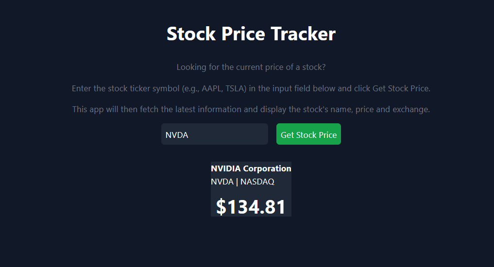

# StockApp



> Aplicativo web que consulta o nome dos ativos, preço e valor.

### Ajustes e melhorias

O projeto ainda está em desenvolvimento e as próximas atualizações serão voltadas para as seguintes tarefas:

- [ ] Adicionar Sistema de Sugestões.
- [ ] Mostrar Valores antigos e tendências dos ativos. 

## 💻 Pré-requisitos

Antes de começar, verifique se você atendeu aos seguintes requisitos:

- Você instalou a versão mais recente de `Node.js`
- Você tem uma máquina `<Windows / Linux / Mac>`. Indique qual sistema operacional é compatível.
- Você Possui `uma API KEY da Stock Price API`.

## 🚀 Instalando 

Para instalar o <StockApp>, siga estas etapas:

```
cd stock-app
npm i
npm run dev
```

## ☕ Usando 

Para usar <StockApp>, siga estas etapas:

```
Adicione sua Api key no /src/APP.jsx.

```

